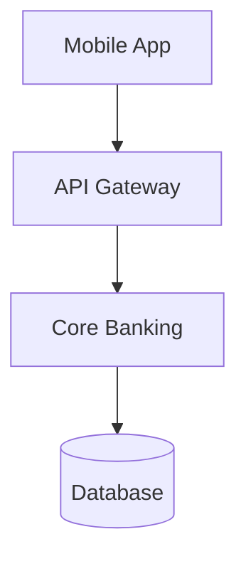

# Quick Start Guide

Get up and running with DSD Agent in 5 minutes.

## 1. Install

```bash
git clone https://github.com/markc1914/dsd-agent.git
cd dsd-agent
pip install -e ".[gui]"
```

## 2. Set API Key

```bash
export ANTHROPIC_API_KEY='your-anthropic-api-key'
```

## 3. Launch GUI

```bash
streamlit run dsd_agent/gui.py
```

## 4. Use

1. **Upload** your PowerPoint file (must have "Lorem Ipsum" placeholders)
2. **Add** your architecture source:
   - 📷 Upload a whiteboard photo
   - 📝 Paste text notes
   - 📊 Enter a Mermaid diagram
3. **Review** extracted components and select slides
4. **Download** your populated document

---

## CLI Alternative

```bash
# Quick populate from image
dsd-agent document.pptx --image whiteboard.jpg

# Preview first (recommended)
dsd-agent document.pptx --image whiteboard.jpg --dry-run
```

---

## Example Input

### Text Notes Format
```
Channels: Mobile App, Web Portal, ATM
Integration: API Gateway, ESB, Message Queue
Core: Core Banking (T24), Card Management, Loans
Data: Oracle Database, Data Warehouse
External: SWIFT, Credit Bureau
```

### Mermaid Format


---

## Need Help?

- Full guide: [USER_GUIDE.md](USER_GUIDE.md)
- Issues: https://github.com/markc1914/dsd-agent/issues
