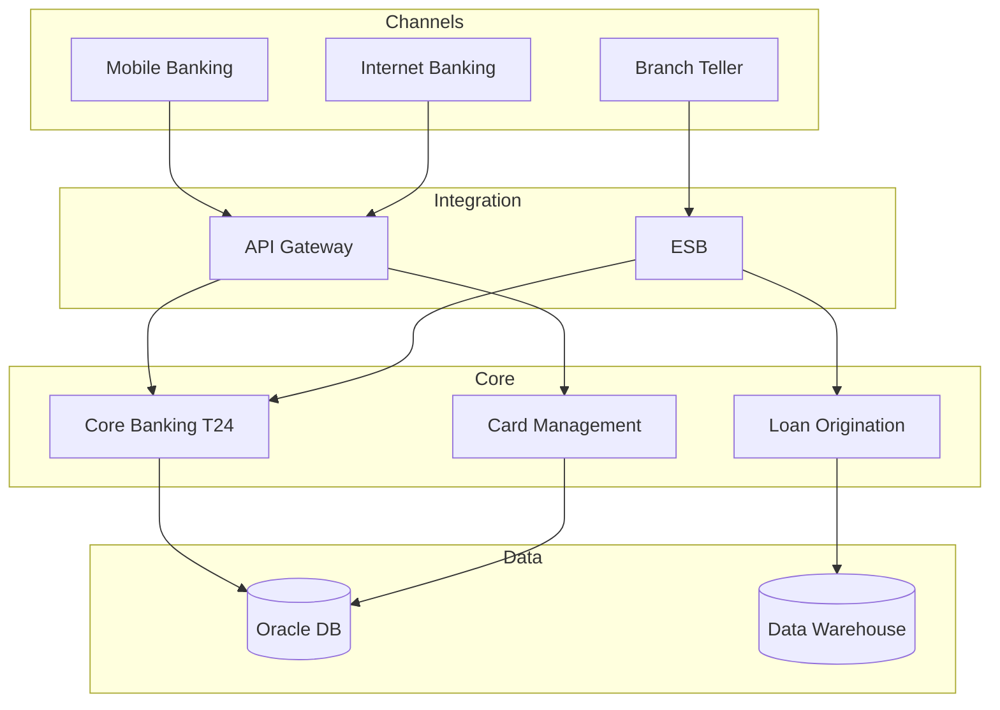

# DSD Agent User Guide

A comprehensive guide to using DSD Agent for populating Digital Solutioning Documents with architecture data.

## Table of Contents

1. [Getting Started](#getting-started)
2. [Installation](#installation)
3. [Using the Web GUI](#using-the-web-gui)
4. [Using the CLI](#using-the-cli)
5. [Architecture Sources](#architecture-sources)
6. [Integration Patterns](#integration-patterns)
7. [Google Slides Support](#google-slides-support)
8. [Best Practices](#best-practices)
9. [Troubleshooting](#troubleshooting)

---

## Getting Started

### What is DSD Agent?

DSD Agent is an AI-powered tool that automatically populates architecture diagrams in PowerPoint and Google Slides presentations. It analyzes your architecture sources (whiteboard photos, diagrams, notes) and intelligently maps system components to placeholder boxes in your slides.

### Key Concepts

| Term | Description |
|------|-------------|
| **DSD** | Digital Solutioning Document - a standardized presentation template for architecture documentation |
| **Placeholder** | A box in your slide containing "Lorem Ipsum" text that will be replaced with actual system names |
| **Architecture Source** | The input you provide: whiteboard photo, Mermaid diagram, or text notes |
| **Mapping** | The process of matching extracted components to slide placeholders |
| **Integration Pattern** | A recognized architectural pattern (e.g., API Gateway, Event-Driven, ESB) |

### Requirements

- Python 3.10 or higher
- Anthropic API key (for Claude AI)
- PowerPoint file with Lorem Ipsum placeholders (or Google Slides presentation ID)

---

## Installation

### Basic Installation

```bash
# Clone the repository
git clone https://github.com/markc1914/dsd-agent.git
cd dsd-agent

# Install the package
pip install -e .
```

### With GUI Support

```bash
pip install -e ".[gui]"
```

### With Google Slides Support

```bash
pip install -e ".[google]"
```

### Full Installation (All Features)

```bash
pip install -e ".[all]"
```

### Setting Up Your API Key

```bash
# Option 1: Environment variable (recommended)
export ANTHROPIC_API_KEY='your-api-key-here'

# Option 2: Add to shell profile (~/.zshrc or ~/.bashrc)
echo 'export ANTHROPIC_API_KEY="your-api-key-here"' >> ~/.zshrc
source ~/.zshrc
```

---

## Using the Web GUI

The web GUI provides the easiest way to use DSD Agent with a visual, step-by-step workflow.

### Launching the GUI

```bash
streamlit run dsd_agent/gui.py
```

Then open http://localhost:8501 in your browser.

### Step 1: Upload Document

1. Enter your Anthropic API key in the sidebar (if not set via environment variable)
2. Drag and drop your PowerPoint file, or click "Browse files"
3. Review the document summary showing:
   - Number of slides with placeholders
   - Slide titles
   - Placeholder counts per slide
4. Click **Continue →**

### Step 2: Provide Architecture Source

Choose one of three input methods:

#### Option A: Image Upload
Best for: Whiteboard photos, screenshots, exported diagrams

1. Click the **📷 Image** tab
2. Drag and drop your image or click to browse
3. Preview the uploaded image
4. Check "Analyze integration patterns" (recommended)
5. Click **🔍 Analyze Image**

#### Option B: Text Notes
Best for: Quick entry, meeting notes, system lists

1. Click the **📝 Text Notes** tab
2. Enter your architecture description in the text area
3. Use a structured format for best results:
   ```
   Channels: Mobile App, Web Portal, Branch System
   Integration: API Gateway, ESB, Message Queue
   Core Systems: Core Banking, Card Management, Loans
   Data: Oracle DB, Data Warehouse, Redis Cache
   External: SWIFT, Credit Bureau, Payment Switch
   ```
4. Click **🔍 Analyze Notes**

#### Option C: Mermaid Diagram
Best for: Existing technical diagrams, precise architecture definitions

1. Click the **📊 Mermaid Diagram** tab
2. Paste your Mermaid code:
   ```mermaid
   graph TD
       A[Mobile App] --> B[API Gateway]
       B --> C[Core Banking]
       B --> D[Card System]
       C --> E[(Database)]
   ```
3. Click **🔍 Analyze Mermaid**

### Step 3: Review & Map

1. **Review Extracted Components**
   - Components are grouped by category (channel, integration, core_banking, data, external)
   - Each component shows its detected layer (presentation, application, data, infrastructure)

2. **View Integration Patterns** (if analyzed)
   - Primary pattern identified
   - Integration style (sync/async/hybrid)
   - Confidence scores for each pattern
   - Recommended technologies

3. **Select Slides**
   - Check/uncheck slides to include in mapping
   - See placeholder counts for each slide

4. **Create Mappings**
   - Toggle "Preview only" for a dry run
   - Click **🚀 Create Mappings**
   - Watch the progress bar as each slide is processed

### Step 4: Download

1. **Review Results**
   - Expand each slide to see mapping details
   - View metrics: mapped count, unmapped placeholders, unused components
   - Check the mapping table for component → position assignments

2. **Download**
   - Enter output filename (default: `populated_document.pptx`)
   - Click **📥 Generate & Download**
   - Save the file to your computer

---

## Using the CLI

### Interactive Mode

Best for first-time users or complex documents:

```bash
dsd-agent --interactive
```

Follow the prompts to:
1. Load your document
2. Select slides to populate
3. Choose your input method
4. Review extracted components
5. Approve mappings
6. Save the result

### Direct Mode

For scripting or quick operations:

```bash
# Analyze document structure only
dsd-agent document.pptx --analyze-only

# Populate from an image
dsd-agent document.pptx --image whiteboard.jpg

# Populate from text notes
dsd-agent document.pptx --notes "Core Banking: T24, CRM: Salesforce, Gateway: Kong"

# Populate from Mermaid file
dsd-agent document.pptx --mermaid architecture.mmd

# Preview without saving
dsd-agent document.pptx --image diagram.png --dry-run

# Filter to specific slide types
dsd-agent document.pptx --image arch.png --filter "current"
dsd-agent document.pptx --image arch.png --filter "target"

# Populate a specific slide only
dsd-agent document.pptx --image arch.png --slide 16

# Custom output path
dsd-agent document.pptx --image arch.png --output result.pptx

# Verbose output
dsd-agent document.pptx --image arch.png --verbose
```

### CLI Options Reference

| Option | Short | Description |
|--------|-------|-------------|
| `--interactive` | `-I` | Run in interactive mode |
| `--image` | `-i` | Path to architecture image |
| `--mermaid` | `-m` | Path to Mermaid diagram file |
| `--notes` | `-n` | Text notes describing architecture |
| `--analyze-only` | | Only show document structure |
| `--output` | `-o` | Output file path |
| `--filter` | `-f` | Filter slides by type (current/target) |
| `--slide` | `-s` | Populate specific slide number |
| `--dry-run` | `-d` | Preview without saving |
| `--verbose` | `-v` | Show detailed output |
| `--api-key` | | Anthropic API key |
| `--google-slides` | `-g` | Google Slides presentation ID |
| `--credentials` | | Google credentials JSON path |

---

## Architecture Sources

### Whiteboard Photos

Tips for best results:
- Ensure good lighting and contrast
- Capture the entire diagram in frame
- Write legibly - Claude Vision reads handwriting
- Include system names, not just boxes
- Add arrows to show relationships

**What Claude extracts:**
- System/component names
- Relationships and data flows
- Layer organization (if visible)
- Integration patterns

### Mermaid Diagrams

Supported diagram types:
- `graph TD` / `graph LR` - Flowcharts
- `sequenceDiagram` - Sequence diagrams
- `classDiagram` - Class diagrams
- `C4Context` / `C4Container` - C4 diagrams

Example banking architecture:


### Text Notes

Structured format (recommended):
```
Channels: Mobile App, Web Portal, ATM, Branch
Integration Layer: API Gateway (Kong), ESB (MuleSoft), Kafka
Core Systems: Core Banking (Temenos T24), Card Management (FIS), Loan Origination (Newgen)
Data Layer: Oracle 19c, PostgreSQL, Redis, Elasticsearch
External Systems: SWIFT, Visa/Mastercard, Credit Bureau (Experian), Regulatory Reporting
Security: OAuth 2.0, PKI, HSM
```

Free-form notes also work:
```
The current architecture has a mobile banking app and web portal connecting through an API gateway.
The gateway routes to the core banking system (Temenos T24) and card management.
There's also an ESB for legacy integrations with the loan system.
Data is stored in Oracle with a separate data warehouse for reporting.
```

---

## Integration Patterns

DSD Agent recognizes 25+ enterprise integration patterns:

### Messaging Patterns
| Pattern | Description | Typical Components |
|---------|-------------|-------------------|
| Point-to-Point | Direct connections between systems | Connectors, Adapters |
| Publish-Subscribe | Event broadcasting to multiple subscribers | Event Bus, Topics |
| Request-Reply | Synchronous request/response | APIs, Services |
| Message Broker | Central message routing | Kafka, RabbitMQ, ActiveMQ |

### Integration Layer Patterns
| Pattern | Description | Typical Components |
|---------|-------------|-------------------|
| API Gateway | Centralized API management | Kong, Apigee, AWS API Gateway |
| ESB | Enterprise Service Bus | MuleSoft, IBM Integration Bus |
| Service Mesh | Microservice communication layer | Istio, Linkerd, Envoy |
| BFF | Backend for Frontend | Custom API layers |

### Event Patterns
| Pattern | Description | Use Case |
|---------|-------------|----------|
| Event-Driven | Asynchronous event-based communication | Real-time processing |
| Event Sourcing | Storing state as event sequence | Audit trails, CQRS |
| CQRS | Command Query Responsibility Segregation | Read/write optimization |

### Microservices Patterns
| Pattern | Description | Use Case |
|---------|-------------|----------|
| Saga | Distributed transaction management | Cross-service transactions |
| Circuit Breaker | Fault tolerance pattern | Service resilience |
| Strangler Fig | Gradual legacy migration | Modernization |

### Data Patterns
| Pattern | Description | Components |
|---------|-------------|------------|
| Data Lake | Raw data storage | S3, ADLS, HDFS |
| Data Warehouse | Structured analytics | Snowflake, Redshift |
| CDC | Change Data Capture | Debezium, Golden Gate |
| ETL | Extract Transform Load | Airflow, Informatica |

---

## Google Slides Support

### Setup

1. Create a Google Cloud project
2. Enable the Google Slides API
3. Create credentials (Service Account or OAuth)
4. Download the credentials JSON file

### Installation

```bash
pip install -e ".[google]"
```

### Usage

```bash
# Set credentials
export GOOGLE_APPLICATION_CREDENTIALS="/path/to/credentials.json"

# Analyze presentation
dsd-agent --google-slides PRESENTATION_ID --analyze-only

# Populate from image
dsd-agent --google-slides PRESENTATION_ID --image whiteboard.jpg

# With explicit credentials path
dsd-agent --google-slides PRESENTATION_ID --image arch.png --credentials /path/to/creds.json
```

### Finding Your Presentation ID

The presentation ID is in the Google Slides URL:
```
https://docs.google.com/presentation/d/PRESENTATION_ID/edit
```

---

## Best Practices

### Preparing Your Document

1. **Use Lorem Ipsum placeholders** - The agent looks for "Lorem Ipsum" text to identify replaceable content
2. **Organize by layers** - Place channel systems at top, data at bottom for best mapping
3. **Use consistent sizing** - Similar components should have similar placeholder sizes
4. **Include a legend** - Small boxes on the side can be used for category labels

### Providing Good Input

1. **Be specific** - "Temenos T24" is better than "Core Banking"
2. **Include all systems** - Don't forget middleware, security, and monitoring
3. **Show relationships** - Diagrams with arrows help identify integration patterns
4. **Categorize clearly** - Group systems by layer or function

### Reviewing Results

1. **Always use dry-run first** - Preview mappings before saving
2. **Check unmapped items** - Adjust input if important components weren't mapped
3. **Verify integration patterns** - Ensure detected patterns match your architecture
4. **Review layer assignments** - Components should be in appropriate rows

---

## Troubleshooting

### Common Issues

#### "API key not set"
```bash
# Check if key is set
echo $ANTHROPIC_API_KEY

# Set it
export ANTHROPIC_API_KEY='your-key'
```

#### "No placeholders found"
- Ensure your document has "Lorem Ipsum" text in the slides
- Check that you're looking at the correct slides (use `--analyze-only`)

#### "Image analysis failed"
- Check image format (supported: PNG, JPG, JPEG, WebP)
- Ensure image is clear and readable
- Try a higher resolution image

#### "Mapping confidence is low"
- Provide more detailed input
- Use structured text notes
- Include system categories in your description

#### Google Slides authentication errors
```bash
# Verify credentials file exists
ls -la $GOOGLE_APPLICATION_CREDENTIALS

# Re-authenticate
gcloud auth application-default login
```

### Getting Help

- **GitHub Issues**: https://github.com/markc1914/dsd-agent/issues
- **Check logs**: Use `--verbose` for detailed output

---

## Quick Reference

### GUI Workflow
```
Upload PPTX → Add Source → Review & Map → Download
```

### CLI Commands
```bash
# GUI
streamlit run dsd_agent/gui.py

# Interactive
dsd-agent --interactive

# Quick populate
dsd-agent doc.pptx --image photo.jpg

# Dry run
dsd-agent doc.pptx --notes "..." --dry-run
```

### Environment Variables
```bash
ANTHROPIC_API_KEY=your-key
GOOGLE_APPLICATION_CREDENTIALS=/path/to/creds.json
```
